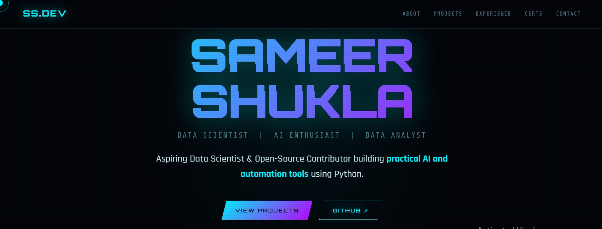
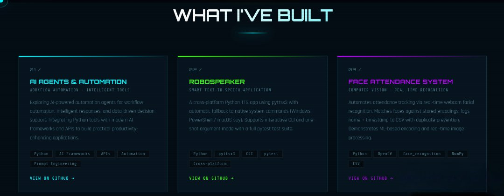
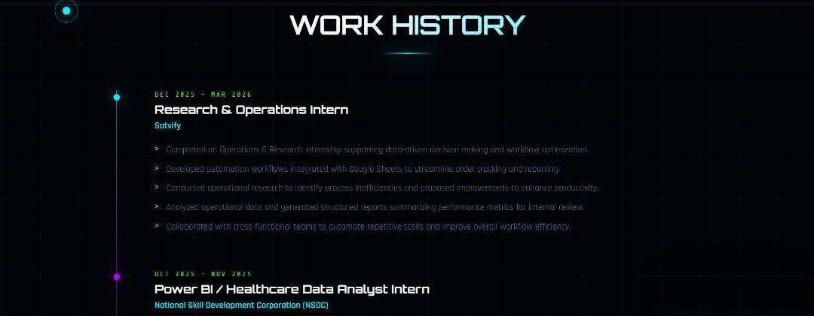

# 🚀 Sameer Shukla — Portfolio

[](https://sameershuklapages.netlify.app)
[](https://github.com/sam7041)
[](https://linkedin.com/in/sameershukla590)

> Personal portfolio website showcasing projects, experience, and certifications with a dark neon hacker aesthetic.

---

## 🖥️ Live Preview


**[👉 View Portfolio →](https://sameershuklapages.netlify.app)**

### Hero Section


### Projects Section


### Experience Section


---

## ✨ Features

- ⚡ **Dark Neon Hacker Aesthetic** — cyan, green, and purple glow effects
- 🎯 **Fully Responsive** — works on mobile, tablet, and desktop
- 🖱️ **Custom Cursor** — animated neon cursor (desktop only)
- 🎞️ **Scroll Reveal Animations** — smooth section entrance effects
- 📜 **Certificate Viewer Modal** — click any cert to view PDF inline
- 🍔 **Hamburger Nav** — mobile-friendly drawer navigation
- ⌨️ **Accessible** — keyboard navigable, focus styles, skip link
- 🔗 **Live GitHub Links** — every project links directly to its repo
- 💾 **No dependencies** — pure HTML, CSS, and vanilla JavaScript

---

## 📁 Project Structure

```
sameer-portfolio/
├── index.html              # Main HTML structure
├── style.css               # All styles & responsive breakpoints
├── script.js               # Cursor, nav, scroll reveal, cert modal
├── cert-ai-agents.pdf      # 365 Data Science — AI Agents cert
├── cert-math-ml.pdf        # 365 Data Science — Math for ML cert
├── cert-bcg.pdf            # BCG GenAI Job Simulation cert
├── cert-deloitte.pdf       # Deloitte Data Analytics cert
└── cert-hansraj.pdf        # Hansraj Case Challenge cert
```

---

## 🛠️ Tech Stack

| Layer      | Technology                        |
|------------|-----------------------------------|
| Structure  | HTML5 (semantic)                  |
| Styling    | CSS3 (variables, grid, flexbox)   |
| Logic      | Vanilla JavaScript (ES6+)         |
| Fonts      | Google Fonts (Orbitron, Rajdhani, Share Tech Mono) |
| Deploy     | Netlify                           |

---

## 🚀 Projects Featured

| # | Project | Tech |
|---|---------|------|
| 01 | [AI Agents & Automation](https://github.com/sam7041/Inventory-Management-automation) | Python, AI Frameworks, APIs |
| 02 | [RoboSpeaker](https://github.com/sam7041/robo_speaker_project) | Python, pyttsx3, pytest |
| 03 | [Face Attendance System](https://github.com/sam7041/face-attendance-system) | Python, OpenCV, face_recognition |
| 04 | [Netflix Dataset Analysis](https://github.com/sam7041/Data-Analysis-Projects) | Python, Pandas, Matplotlib |
| 05 | [US Store Sales Forecast](https://github.com/sam7041/Data-Analysis-Projects) | Python, Scikit-learn, Time Series |
| 06 | [Task Manager App](https://github.com/sam7041/A-Task-Manager) *(In Dev)* | React, Node.js |

---

## 🏅 Certifications

- 🤖 Intro to AI Agents & Agentic AI — **365 Data Science** (Nov 2025)
- 🧮 Math Foundation for ML — **365 Data Science** (Nov 2025)
- 🧠 GenAI Job Simulation — **BCG × Forage** (Jun 2025)
- 📊 Data Analytics Job Simulation — **Deloitte × Forage** (Jun 2025)
- 🏆 Hansraj Case Challenge 3.0 — **Hansraj College × HK University** (Apr 2023)

---

## 💼 Experience

- **Research & Operations Intern** @ Satvify *(Dec 2025 – Mar 2026)*
- **Power BI / Healthcare Data Analyst Intern** @ NSDC *(Oct 2025 – Nov 2025)*

---

## 🌐 Deploy Your Own

### Option 1 — Netlify Drop *(currently live)*
1. Go to [netlify.com/drop](https://netlify.com/drop)
2. Drag the entire project folder
3. Get a live URL instantly
- Deployed at **[sameershuklapages.netlify.app](https://sameershuklapages.netlify.app)**

### Option 2 — GitHub Pages
1. Push this repo to GitHub
2. Go to **Settings → Pages**
3. Set source to **main branch / root**
4. Your site will be live at `https://username.github.io/repo-name`

---

## 📬 Contact

| Platform | Link |
|----------|------|
| 📧 Email | sameershukla590@gmail.com |
| 💼 LinkedIn | [sameershukla590](https://linkedin.com/in/sameershukla590) |
| 🐙 GitHub | [sam7041](https://github.com/sam7041) |
| 📸 Instagram | [shuklasameer590](https://instagram.com/shuklasameer590) |

---

## 📄 License

This project is open source and available under the [MIT License](LICENSE).

---

<p align="center">
  Built with 💙 by Sameer Shukla · Delhi, India
</p>
